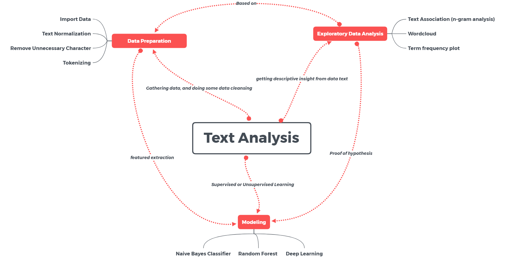

```{r setup-env, include=FALSE}
# chunk output settings
knitr::opts_chunk$set(
  echo = FALSE,
  message = FALSE,
  warning = FALSE,
  fig.asp = 0.5625,
  fig.align = "center",
  out.width = "85%",
  collapse = TRUE,
  comment = "#>"
)
```

```{r setup-libs, include=FALSE}
# import libs
library(broom)
library(knitr)
library(kableExtra)
library(tidyverse)
library(tidytext)
library(textclean)
```

# Overview

---

The topic to be discussed is about *introduction to text mining*. We will go through brief explanation about step to process text data including data preparation, exploratory data analysis, and modeling. I recommend that you have: 

* Familiarity with R programming
* Familiarity with data analysis workflow
  * data preparation
  * cross validation
  * model fitting
  * model evaluation
* a high curiosity and willingness to learn in term of text data processing.


# Concept Maps

---

```{r out.width="100%", fig.align="center"}

```

# Use Case: Twitter US Airline Sentiment

## The Main Problem

Analyze how travelers in February 2015 expressed their feelings on twitter. 

---

*Dataset*:

```{r, echo=FALSE}
# import data
data <- read_csv("data/tweets.csv")


# print examples
data %>% 
  select(text, airline_sentiment) %>% 
  head() %>% 
  kable()
```

# Steps of analysis

---

* Data Preparation
* Exploratory Data Ananlysis
* Modeling

---

## Data Preparation

---

In data text problem, the common ways to prepare the data includes:

1. Text Normalization
2. Removing Unnecessary Character
3. Tokenization & Document term matrix

The output of these processes will help build the input of the machine learning models you create to analyze your data (feature extraction).

---

**Text Normalization**:

1. *Replace word lengthening*.
2. *Convert all string to lowercase/uppercase*.

---

Example: Replace words elongations with known semantic replacements.

*@VirginAmerica heyyyy guyyyys..*, will be normalized to:

*@VirginAmarica hey guys..*

---

**Removing Unnecessary Character**: we will remove all characters that unexpectedly affect sentiment, such as:

* Remove number
* Remove punctuations
* Remove url
* Remove stopwords (list of common words that does not help for modeling, *e.g.: I, you, their, do, etc*)

---

```{r}
# data cleansing
data <- data %>% 
  mutate(
    text_clean = text %>% 
      replace_url() %>% 
      replace_emoji() %>% 
      replace_emoticon() %>% 
      replace_html() %>% 
      str_remove_all(pattern = "(@)[A-z0-9]+") %>% 
      str_remove_all(pattern = "(#)[A-z0-9]+") %>% 
      replace_contraction() %>% 
      replace_word_elongation() %>% 
      str_remove_all(pattern = "[[:punct:]]") %>% 
      str_remove_all(pattern = "\\d") %>% 
      str_remove_all(pattern = "(\\$)") %>% 
      str_to_lower() %>% 
      str_squish()
  )

data %>% 
  select(text_clean, airline_sentiment) %>% 
  sample_n(5) %>% 
  kable()
```


---

**Tokenization**: is the act of breaking up a sequence of strings into pieces such as words, keywords, phrases, symbols and other elements called tokens.

**Document Term Matrix**: 

A computer cannot store "letters", "numbers", "pictures" or anything else. The only thing it can store and work with are *bits* or a numerical value that represent a text.


```{r out.width="75%", fig.align="center"}
include_graphics("assets/img/intro/DTM.png")
```

## Exploratory Data Analysis

---

In exploring a data text problem, one of the fundamental exploratory step is find the frequency of term from the list document text. One of the most common visualization is Wordcloud.

---


```{r}
data %>% 
  filter(airline_sentiment %in% c("positive", "negative")) %>% 
  unnest_tokens(word, text_clean) %>% 
  count(word, sort = TRUE) %>% 
  filter(!(word %in% stopwords::stopwords(language = "en"))) %>% 
  with(wordcloud::wordcloud(word, n, random.order = F, max.words = 100))
```


---

Most term frequency for each sentiment:

```{r}
top_positive <- data %>% 
  filter(airline_sentiment == "positive") %>% 
  unnest_tokens(word, text_clean) %>% 
  count(word, airline_sentiment, sort = TRUE) %>% 
  filter(!(word %in% stopwords::stopwords(language = "en"))) %>% 
  head(20)

top_negative <- data %>% 
  filter(airline_sentiment == "negative") %>% 
  unnest_tokens(word, text_clean) %>% 
  count(word, airline_sentiment, sort = TRUE) %>% 
  filter(!(word %in% stopwords::stopwords(language = "en"))) %>% 
  head(20) 
```

```{r}
bind_rows(top_positive, top_negative) %>% 
  ggplot(mapping = aes(x = reorder(word, n), y = n)) +
  geom_col() +
  coord_flip() +
  facet_wrap(~airline_sentiment, scales = "free") +
  theme_minimal() +
  labs(x = "Terms",
       y = "Freq")
```

The term of *flight* more often appears as negative sentiment. So we can make an initial hypothesis, the term *flight* can increase the possibility that review will be classified as negative sentiments.

# Modeling

## Steps used Modeling

* Cross Validation

To simulate error in future or unseen dataset

* Model Fitting

Modelling process, and if needed, including prediction

* Model Evaluation

To ensure our model already have the minimal error in unseen data

---

Model evaluation:

```{r}
read_csv(file = "data/conf_mat.csv") %>% 
  kable()
```

An example of tweet containing the word *flight* that classified as negative sentiment:

*@VirginAmerica I’m having trouble adding this flight my wife booked to my Elevate account. Help? http://t.co/pX8hQOKS3R*

# Quiz

## Q.1

When doing data preparation, what step that aimed for standardizing text according to their semantic meaning?

- [ ] tokenizing
- [ ] text normalization
- [ ] remove stopwords

## Q.2

These are some criteria that make up clean text data before further analysis, EXCEPT:

- [ ] numeric value does not exist in text data.
- [ ] capital format at the first letter of each word.
- [ ] there are no *word lengthening* in the text data.

## Q.3

What is the purpose of exploratory data analysis on text mining?

- [ ] to prepare raw data text into a format that is needed for model building
- [ ] process of gaining insight and improve our undestanding about text data.
- [ ] to convert text data into a numerical representative format.


# Happy Learning! `r emojifont::emoji("grin")`
